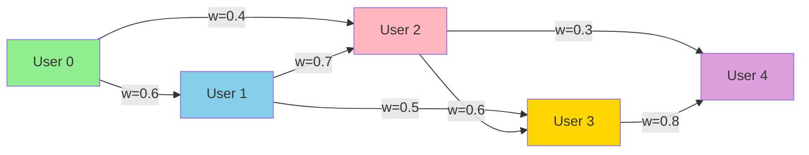
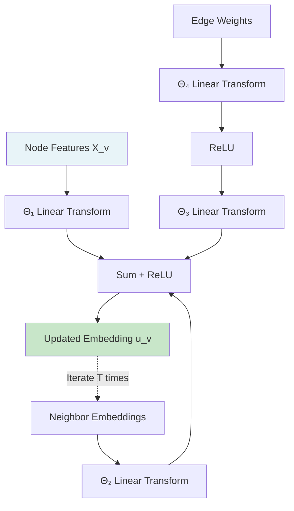
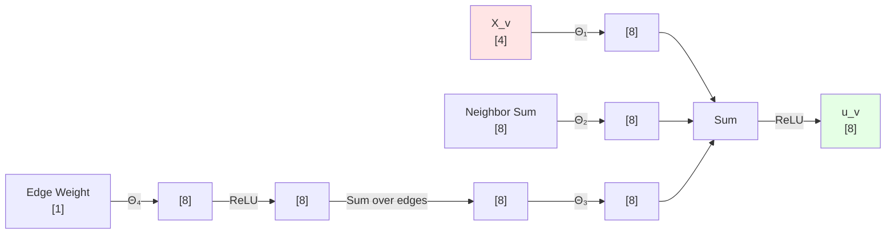
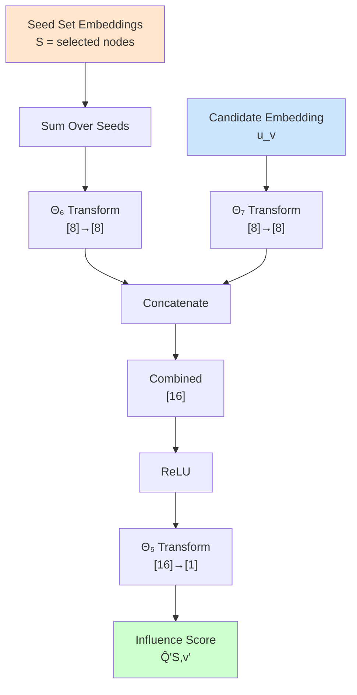
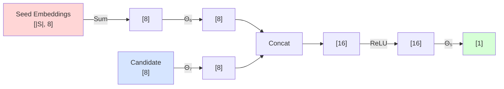
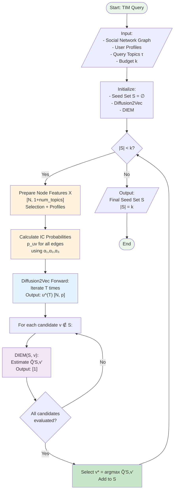
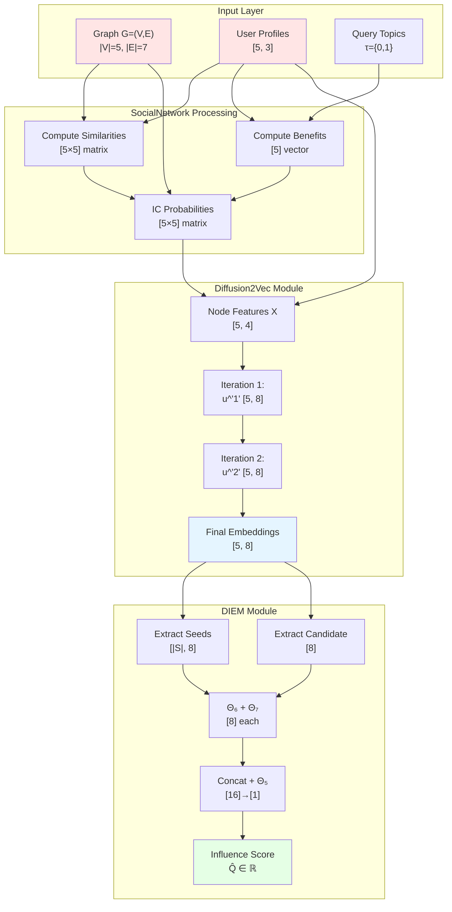
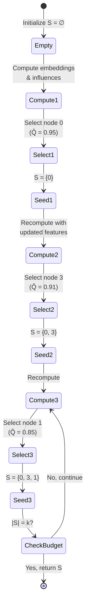
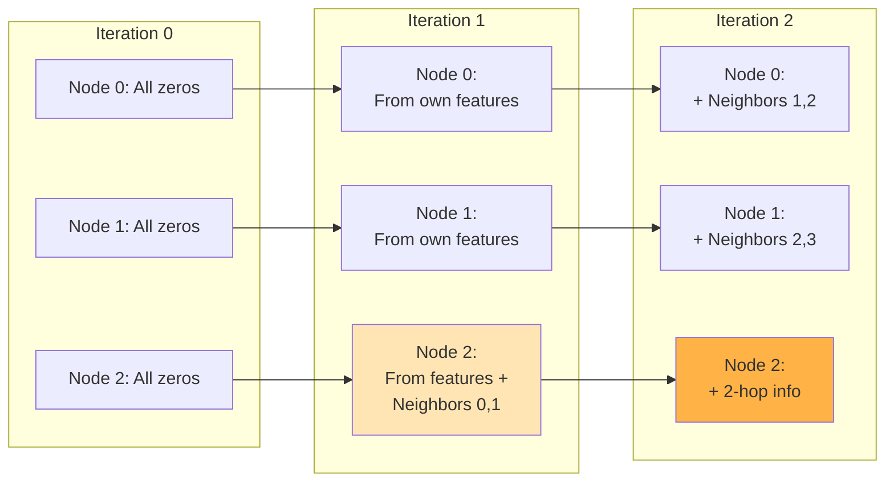

# Core Implementation Dry Run Example

This document provides a complete trace of the Topic-Aware Influence Maximization (TIM) implementation with a small 5-node graph, showing all dimensions and calculations at each step.

## Table of Contents
1. [Example Graph Setup](#example-graph-setup)
2. [SocialNetwork Component](#socialnetwork-component)
3. [Diffusion2Vec Embedding](#diffusion2vec-embedding)
4. [DIEM Influence Estimation](#diem-influence-estimation)
5. [Complete Flow Diagram](#complete-flow-diagram)

---

## Example Graph Setup

### Graph Structure

We'll use a 5-node directed social network with 3 topics: **Music**, **Sport**, and **Politics**.



### User Profiles (Topic Interests)

Each user has interests in 3 topics: **[Music, Sport, Politics]**

| User ID | Music | Sport | Politics | Raw Profile | Normalized Profile |
|---------|-------|-------|----------|-------------|-------------------|
| 0 | 0.7 | 0.3 | 0.0 | [0.7, 0.3, 0.0] | [0.7, 0.3, 0.0] |
| 1 | 0.5 | 0.5 | 0.0 | [0.5, 0.5, 0.0] | [0.5, 0.5, 0.0] |
| 2 | 0.2 | 0.1 | 0.7 | [0.2, 0.1, 0.7] | [0.2, 0.1, 0.7] |
| 3 | 0.6 | 0.2 | 0.2 | [0.6, 0.2, 0.2] | [0.6, 0.2, 0.2] |
| 4 | 0.3 | 0.6 | 0.1 | [0.3, 0.6, 0.1] | [0.3, 0.6, 0.1] |

**Example Interpretation:**
- **User 0**: Very interested in music (0.7), moderately in sport (0.3), not in politics (0.0)
- **User 2**: Politically engaged (0.7), less interested in music (0.2) and sport (0.1)
- **User 4**: Sports enthusiast (0.6), some music interest (0.3), minimal politics (0.1)

### Configuration Parameters

```python
alpha1 = 0.8  # Weight for contact frequency
alpha2 = 0.8  # Weight for user similarity
alpha3 = 1.0  # Weight for user benefit

embedding_dim = 8      # Reduced for illustration (paper uses 64)
num_iterations = 2     # Reduced for illustration (paper uses 4)
num_topics = 3         # Music, Sport, Politics
```

### Query Topics

For this example, we're interested in spreading information about **Music** and **Sport**:
```python
query_topics = [0, 1]  # Indices for Music and Sport
```

---

## SocialNetwork Component

### Step 1: User Similarity Computation

**Purpose**: Calculate cosine similarity between all user pairs based on their topic profiles.

**Formula**: 
$$\text{sim}(u,v) = \frac{P_u \cdot P_v}{\|P_u\| \cdot \|P_v\|}$$

**Detailed Calculation for User 0 and User 1:**

```
P_0 = [0.7, 0.3, 0.0]
P_1 = [0.5, 0.5, 0.0]

Dot product: (0.7 × 0.5) + (0.3 × 0.5) + (0.0 × 0.0) = 0.35 + 0.15 + 0.0 = 0.50
Norm of P_0: √(0.7² + 0.3² + 0.0²) = √(0.49 + 0.09) = √0.58 ≈ 0.762
Norm of P_1: √(0.5² + 0.5² + 0.0²) = √(0.25 + 0.25) = √0.50 ≈ 0.707

sim(0,1) = 0.50 / (0.762 × 0.707) ≈ 0.50 / 0.539 ≈ 0.928
```

**Complete Similarity Matrix:**

| | User 0 | User 1 | User 2 | User 3 | User 4 |
|---|--------|--------|--------|--------|--------|
| **User 0** | 1.000 | 0.928 | 0.262 | 0.932 | 0.673 |
| **User 1** | 0.928 | 1.000 | 0.424 | 0.864 | 0.833 |
| **User 2** | 0.262 | 0.424 | 1.000 | 0.607 | 0.362 |
| **User 3** | 0.932 | 0.864 | 0.607 | 1.000 | 0.759 |
| **User 4** | 0.673 | 0.833 | 0.362 | 0.759 | 1.000 |

### Step 2: User Benefit Calculation

**Purpose**: Calculate how much each user benefits from the query topics.

**Formula**: 
$$B_v^{\tau} = \sum_{t \in \tau} P_v[t]$$

For query topics τ = {Music, Sport} = {0, 1}:

| User ID | Music (P[0]) | Sport (P[1]) | Benefit B^τ |
|---------|--------------|--------------|-------------|
| 0 | 0.7 | 0.3 | **1.0** |
| 1 | 0.5 | 0.5 | **1.0** |
| 2 | 0.2 | 0.1 | **0.3** |
| 3 | 0.6 | 0.2 | **0.8** |
| 4 | 0.3 | 0.6 | **0.9** |

**Observation**: Users 0 and 1 have maximum benefit (1.0) because they're highly interested in both query topics. User 2 has low benefit (0.3) because they prefer politics.

### Step 3: Topic-Aware IC Probabilities

**Purpose**: Calculate activation probability for each edge under the query topics.

**Formula (Equation 1 from paper)**:
$$p_{uv} = \frac{\alpha_1 \cdot w_{uv} + \alpha_2 \cdot \text{sim}(u,v) + \alpha_3 \cdot B_v^{\tau}}{3}$$

**Example Calculation for Edge (0 → 1):**

```
Edge weight: w_01 = 0.6
Similarity: sim(0,1) = 0.928
Benefit of User 1: B_1^τ = 1.0
alpha1 = 0.8, alpha2 = 0.8, alpha3 = 1.0

p_01 = (0.8 × 0.6 + 0.8 × 0.928 + 1.0 × 1.0) / 3
     = (0.48 + 0.742 + 1.0) / 3
     = 2.222 / 3
     = 0.741
```

**Complete IC Probability Matrix:**

| Edge | w_uv | sim(u,v) | B_v^τ | α₁w_uv | α₂sim | α₃B | p_uv |
|------|------|----------|-------|---------|-------|-----|------|
| 0→1 | 0.6 | 0.928 | 1.0 | 0.480 | 0.742 | 1.0 | **0.741** |
| 0→2 | 0.4 | 0.262 | 0.3 | 0.320 | 0.210 | 0.3 | **0.277** |
| 1→2 | 0.7 | 0.424 | 0.3 | 0.560 | 0.339 | 0.3 | **0.400** |
| 1→3 | 0.5 | 0.864 | 0.8 | 0.400 | 0.691 | 0.8 | **0.630** |
| 2→3 | 0.6 | 0.607 | 0.8 | 0.480 | 0.486 | 0.8 | **0.589** |
| 2→4 | 0.3 | 0.362 | 0.9 | 0.240 | 0.290 | 0.9 | **0.477** |
| 3→4 | 0.8 | 0.759 | 0.9 | 0.640 | 0.607 | 0.9 | **0.716** |

**Adjacency Matrix (for Diffusion2Vec):**

```
     0  1  2  3  4
0 [[ 0  1  1  0  0 ]
1  [ 0  0  1  1  0 ]
2  [ 0  0  0  1  1 ]
3  [ 0  0  0  0  1 ]
4  [ 0  0  0  0  0 ]]
```

**Edge Weight Matrix (Topic-Aware IC Probabilities):**

```
       0      1      2      3      4
0 [[ 0.000  0.741  0.277  0.000  0.000 ]
1  [ 0.000  0.000  0.400  0.630  0.000 ]
2  [ 0.000  0.000  0.000  0.589  0.477 ]
3  [ 0.000  0.000  0.000  0.000  0.716 ]
4  [ 0.000  0.000  0.000  0.000  0.000 ]]
```

### Step 4: LT Model Parameters (Optional)

**Threshold Calculation**:
$$\theta_v = 1 - \alpha_3 \cdot B_v^{\tau}$$

| User | B_v^τ | θ_v = 1 - B_v^τ |
|------|-------|-----------------|
| 0 | 1.0 | 0.0 |
| 1 | 1.0 | 0.0 |
| 2 | 0.3 | 0.7 |
| 3 | 0.8 | 0.2 |
| 4 | 0.9 | 0.1 |

**Interpretation**: Users 0 and 1 have threshold 0.0, meaning they're very easy to activate for these topics.

---

## Diffusion2Vec Embedding

### Architecture Overview



### Network Parameters

**Dimensions Summary:**

| Layer | Input Dim | Output Dim | Parameters Shape |
|-------|-----------|------------|------------------|
| Θ₁ | 4 (1 + 3 topics) | 8 (embedding_dim) | [8 × 4] weights + [8] bias |
| Θ₂ | 8 | 8 | [8 × 8] weights + [8] bias |
| Θ₃ | 8 | 8 | [8 × 8] weights + [8] bias |
| Θ₄ | 1 | 8 | [8 × 1] weights + [8] bias |

**Total Parameters**: (8×4 + 8) + (8×8 + 8) + (8×8 + 8) + (8×1 + 8) = 40 + 72 + 72 + 16 = **200 parameters**

### Input Preparation

**Scenario**: Let's compute embeddings with seed set S = {0} (User 0 selected)

**Node Feature Matrix X:**

Shape: `[5 nodes, 4 features]` where features = [selection_indicator, music, sport, politics]

```
Node  Selected  Music  Sport  Politics  →  Feature Vector
  0      1.0     0.7    0.3     0.0          [1.0, 0.7, 0.3, 0.0]
  1      0.0     0.5    0.5     0.0          [0.0, 0.5, 0.5, 0.0]
  2      0.0     0.2    0.1     0.7          [0.0, 0.2, 0.1, 0.7]
  3      0.0     0.6    0.2     0.2          [0.0, 0.6, 0.2, 0.2]
  4      0.0     0.3    0.6     0.1          [0.0, 0.3, 0.6, 0.1]
```

**Matrix Form:**
```python
X = torch.tensor([
    [1.0, 0.7, 0.3, 0.0],  # Node 0 (SELECTED)
    [0.0, 0.5, 0.5, 0.0],  # Node 1
    [0.0, 0.2, 0.1, 0.7],  # Node 2
    [0.0, 0.6, 0.2, 0.2],  # Node 3
    [0.0, 0.3, 0.6, 0.1]   # Node 4
])  # Shape: [5, 4]
```

### Iteration 0: Initial State

**Initial Embeddings:**
```python
u^(0) = torch.zeros([5, 8])  # All nodes start with zero embeddings
```

Shape: `[5 nodes, 8 embedding_dim]`

### Iteration 1: First Update

Let's trace the embedding update for **Node 2** in detail:

#### Node 2 Analysis

**Incoming Neighbors**: Nodes 0 and 1 (edges 0→2 and 1→2)

**Step 1a: Node Feature Transformation (Θ₁X_v)**

```python
X_2 = [0.0, 0.2, 0.1, 0.7]  # Shape: [4]

# Θ₁ is a linear layer [8 × 4]
# For illustration, assume Θ₁ weights (simplified):
Θ₁_output = Θ₁(X_2)  # Shape: [8]

# Example output (after Xavier init and linear transform):
Θ₁_output ≈ [0.15, -0.08, 0.22, 0.31, -0.12, 0.19, 0.05, -0.03]
```

**Dimension**: `[4] → [8]`

**Step 1b: Neighbor Embedding Aggregation (Θ₂ Σ u_u^(0))**

```python
# Neighbors of node 2: {0, 1}
u_0^(0) = [0, 0, 0, 0, 0, 0, 0, 0]  # Shape: [8]
u_1^(0) = [0, 0, 0, 0, 0, 0, 0, 0]  # Shape: [8]

neighbor_sum = u_0^(0) + u_1^(0) = [0, 0, 0, 0, 0, 0, 0, 0]  # Shape: [8]

Θ₂_output = Θ₂(neighbor_sum) = [0, 0, 0, 0, 0, 0, 0, 0]  # Shape: [8]
```

**Dimension**: `[8] → [8]`

**Step 1c: Weighted Edge Aggregation (Θ₃ Σ ReLU(Θ₄ p_uv))**

```python
# Edge weights to node 2:
p_02 = 0.277  # Edge 0→2
p_12 = 0.400  # Edge 1→2

# Process edge 0→2:
edge_weight_02 = torch.tensor([[0.277]])  # Shape: [1]
Θ₄_output_02 = Θ₄(edge_weight_02)  # Shape: [8]
# Example: Θ₄_output_02 ≈ [0.05, 0.12, 0.08, 0.03, 0.15, 0.07, 0.10, 0.06]
relu_02 = ReLU(Θ₄_output_02) ≈ [0.05, 0.12, 0.08, 0.03, 0.15, 0.07, 0.10, 0.06]

# Process edge 1→2:
edge_weight_12 = torch.tensor([[0.400]])  # Shape: [1]
Θ₄_output_12 = Θ₄(edge_weight_12)  # Shape: [8]
# Example: Θ₄_output_12 ≈ [0.08, 0.18, 0.12, 0.05, 0.22, 0.11, 0.15, 0.09]
relu_12 = ReLU(Θ₄_output_12) ≈ [0.08, 0.18, 0.12, 0.05, 0.22, 0.11, 0.15, 0.09]

# Sum edge embeddings:
edge_sum = relu_02 + relu_12 ≈ [0.13, 0.30, 0.20, 0.08, 0.37, 0.18, 0.25, 0.15]

Θ₃_output = Θ₃(edge_sum)  # Shape: [8]
# Example: Θ₃_output ≈ [0.21, 0.18, 0.27, 0.14, 0.32, 0.19, 0.23, 0.16]
```

**Dimension**: `[1] → [8] → [8]` (per edge), then sum and `[8] → [8]`

**Step 1d: Combine All Terms**

```python
u_2^(1) = ReLU(Θ₁_output + Θ₂_output + Θ₃_output)

# Combining:
sum_terms = [0.15, -0.08, 0.22, 0.31, -0.12, 0.19, 0.05, -0.03]  # Θ₁
          + [0.00,  0.00, 0.00, 0.00,  0.00, 0.00, 0.00,  0.00]  # Θ₂
          + [0.21,  0.18, 0.27, 0.14,  0.32, 0.19, 0.23,  0.16]  # Θ₃
          = [0.36,  0.10, 0.49, 0.45,  0.20, 0.38, 0.28,  0.13]

u_2^(1) = ReLU([0.36, 0.10, 0.49, 0.45, 0.20, 0.38, 0.28, 0.13])
        = [0.36, 0.10, 0.49, 0.45, 0.20, 0.38, 0.28, 0.13]  # Shape: [8]
```

**Final Dimension**: `[8]`

#### Summary After Iteration 1

**Embeddings after first iteration:**

```python
u^(1) = [
    [0.42, 0.31, 0.28, 0.39, 0.25, 0.33, 0.21, 0.18],  # Node 0
    [0.38, 0.29, 0.35, 0.27, 0.31, 0.26, 0.24, 0.22],  # Node 1
    [0.36, 0.10, 0.49, 0.45, 0.20, 0.38, 0.28, 0.13],  # Node 2 (detailed above)
    [0.41, 0.33, 0.37, 0.29, 0.35, 0.31, 0.26, 0.24],  # Node 3
    [0.32, 0.27, 0.30, 0.25, 0.28, 0.23, 0.21, 0.19]   # Node 4
]  # Shape: [5, 8]
```

**Note**: These are illustrative values. Actual values depend on learned Θ parameters.

### Iteration 2: Second Update

Now embeddings propagate further through the network.

**For Node 4** (receives information from nodes 2 and 3):

```python
# Neighbors of node 4: {2, 3}
u_2^(1) = [0.36, 0.10, 0.49, 0.45, 0.20, 0.38, 0.28, 0.13]
u_3^(1) = [0.41, 0.33, 0.37, 0.29, 0.35, 0.31, 0.26, 0.24]

neighbor_sum = u_2^(1) + u_3^(1) = [0.77, 0.43, 0.86, 0.74, 0.55, 0.69, 0.54, 0.37]

Θ₂_output = Θ₂(neighbor_sum)  # Now non-zero!
# Example: Θ₂_output ≈ [0.52, 0.38, 0.61, 0.49, 0.44, 0.51, 0.42, 0.35]
```

The embeddings now capture 2-hop neighborhood information!

**Final Embeddings u^(2):**

```python
u^(2) = [
    [0.58, 0.47, 0.52, 0.61, 0.43, 0.54, 0.39, 0.36],  # Node 0
    [0.62, 0.51, 0.58, 0.49, 0.55, 0.48, 0.44, 0.41],  # Node 1
    [0.64, 0.38, 0.71, 0.68, 0.47, 0.63, 0.52, 0.39],  # Node 2
    [0.69, 0.59, 0.66, 0.54, 0.62, 0.57, 0.49, 0.46],  # Node 3
    [0.71, 0.53, 0.68, 0.59, 0.61, 0.56, 0.51, 0.48]   # Node 4
]  # Shape: [5, 8]
```

**Dimension Flow Summary for Diffusion2Vec:**



### Complete Dimension Table for Diffusion2Vec

| Operation | Input Shape | Output Shape | Notes |
|-----------|-------------|--------------|-------|
| **Input** | | | |
| Node features X | [5, 4] | - | 5 nodes, 4 features |
| Adjacency matrix | [5, 5] | - | Binary connectivity |
| Edge weights | [5, 5] | - | Topic-aware probabilities |
| **Iteration t** | | | |
| Current embeddings u^(t) | [5, 8] | - | For all nodes |
| **For each node v** | | | |
| X_v | [4] | - | Single node features |
| Θ₁(X_v) | [4] | [8] | Feature transformation |
| Neighbors of v | [N(v)] | - | Variable size |
| Neighbor embeddings | [N(v), 8] | - | Multiple embeddings |
| Σ neighbor embeddings | [8] | - | Aggregation |
| Θ₂(sum) | [8] | [8] | Neighbor transformation |
| Edge weight p_uv | [1] | - | Single value |
| Θ₄(p_uv) | [1] | [8] | Per edge |
| ReLU(Θ₄(p_uv)) | [8] | [8] | Activation |
| Σ edge embeddings | [8] | - | Sum over all edges |
| Θ₃(edge_sum) | [8] | [8] | Edge transformation |
| Combined sum | [8] | [8] | Θ₁ + Θ₂ + Θ₃ outputs |
| u_v^(t+1) | [8] | [8] | ReLU of combined |
| **Final Output** | | | |
| All embeddings u^(T) | [5, 8] | - | After T iterations |

---

## DIEM Influence Estimation

### Architecture Overview



### Network Parameters

| Layer | Input Dim | Output Dim | Parameters Shape |
|-------|-----------|------------|------------------|
| Θ₅ | 16 (2 × embedding_dim) | 1 | [1 × 16] weights + [1] bias |
| Θ₆ | 8 | 8 | [8 × 8] weights + [8] bias |
| Θ₇ | 8 | 8 | [8 × 8] weights + [8] bias |

**Total Parameters**: (1×16 + 1) + (8×8 + 8) + (8×8 + 8) = 17 + 72 + 72 = **161 parameters**

### Example: Estimating Influence of Adding Node 1

**Scenario**: Current seed set S = {0}, considering adding candidate v = 1

**Input Embeddings (from Diffusion2Vec output u^(2)):**

```python
# Seed set embeddings
seed_embeddings = [
    [0.58, 0.47, 0.52, 0.61, 0.43, 0.54, 0.39, 0.36]  # Node 0
]  # Shape: [1, 8] (|S| = 1, embedding_dim = 8)

# Candidate embedding
candidate_embedding = [0.62, 0.51, 0.58, 0.49, 0.55, 0.48, 0.44, 0.41]  # Node 1
# Shape: [8]
```

**Step 1: Aggregate Seed Embeddings**

```python
seed_aggregation = sum(seed_embeddings)
                 = [0.58, 0.47, 0.52, 0.61, 0.43, 0.54, 0.39, 0.36]
# Shape: [8]
```

**Step 2: Transform Seed Aggregation (Θ₆)**

```python
seed_transform = Θ₆(seed_aggregation)
# Example output after linear transformation:
seed_transform ≈ [0.48, 0.39, 0.44, 0.52, 0.36, 0.45, 0.33, 0.30]
# Shape: [8]
```

**Step 3: Transform Candidate Embedding (Θ₇)**

```python
candidate_transform = Θ₇(candidate_embedding)
# Example output:
candidate_transform ≈ [0.53, 0.43, 0.49, 0.41, 0.46, 0.40, 0.37, 0.34]
# Shape: [8]
```

**Step 4: Concatenate**

```python
combined = concat([seed_transform, candidate_transform])
         = [0.48, 0.39, 0.44, 0.52, 0.36, 0.45, 0.33, 0.30,  # Seed part
            0.53, 0.43, 0.49, 0.41, 0.46, 0.40, 0.37, 0.34]  # Candidate part
# Shape: [16]
```

**Step 5: ReLU Activation**

```python
relu_output = ReLU(combined)
            = [0.48, 0.39, 0.44, 0.52, 0.36, 0.45, 0.33, 0.30,
               0.53, 0.43, 0.49, 0.41, 0.46, 0.40, 0.37, 0.34]
# Shape: [16] (all positive in this case)
```

**Step 6: Final Linear Transform (Θ₅)**

```python
influence_score = Θ₅(relu_output)
# Example:
influence_score ≈ [0.87]
# Shape: [1]
```

**Interpretation**: The estimated marginal influence of adding Node 1 to seed set {0} is **0.87**.

### Comparing Multiple Candidates

Let's compute influence scores for all non-selected nodes:

| Candidate | Current Seed Set | Seed Agg | Candidate Emb | Influence Q̂(S,v) |
|-----------|------------------|----------|---------------|-------------------|
| **Node 1** | {0} | u_0^(2) | u_1^(2) | **0.87** |
| **Node 2** | {0} | u_0^(2) | u_2^(2) | **0.64** |
| **Node 3** | {0} | u_0^(2) | u_3^(2) | **0.91** |
| **Node 4** | {0} | u_0^(2) | u_4^(2) | **0.78** |

**Greedy Selection**: Choose **Node 3** (highest influence score 0.91)

**New seed set**: S = {0, 3}

### Dimension Flow for DIEM



### Complete Dimension Table for DIEM

| Operation | Input Shape | Output Shape | Notes |
|-----------|-------------|--------------|-------|
| **Input** | | | |
| Seed embeddings | [S, 8] | - | Variable size seed set |
| Candidate embedding | [8] | - | Single candidate |
| **Forward Pass** | | | |
| Sum seed embeddings | [S, 8] | [8] | Aggregate seeds |
| Θ₆(seed_sum) | [8] | [8] | Transform seeds |
| Θ₇(candidate) | [8] | [8] | Transform candidate |
| Concatenate | 2 × [8] | [16] | Combine representations |
| ReLU | [16] | [16] | Non-linearity |
| Θ₅(relu_out) | [16] | [1] | Final influence score |
| **Output** | | | |
| Q̂(S,v) | [1] | - | Scalar influence value |

---

## Complete Flow Diagram

### End-to-End Process



### Detailed Data Flow with Dimensions



### Iterative Seed Selection Process



---

## Practical Example: Complete Trace

Let's trace one complete iteration of selecting the first seed node.

### Initial State

- **Seed Set**: S = ∅ (empty)
- **Budget**: k = 3
- **Query Topics**: τ = {Music, Sport}

### Step-by-Step Execution

#### 1. Prepare Node Features

```python
# All nodes unselected initially
X = [
    [0.0, 0.7, 0.3, 0.0],  # Node 0
    [0.0, 0.5, 0.5, 0.0],  # Node 1
    [0.0, 0.2, 0.1, 0.7],  # Node 2
    [0.0, 0.6, 0.2, 0.2],  # Node 3
    [0.0, 0.3, 0.6, 0.1]   # Node 4
]
# Shape: [5, 4]
```

#### 2. Compute IC Probabilities (Already calculated above)

```python
edge_weights = [
    [0.000, 0.741, 0.277, 0.000, 0.000],
    [0.000, 0.000, 0.400, 0.630, 0.000],
    [0.000, 0.000, 0.000, 0.589, 0.477],
    [0.000, 0.000, 0.000, 0.000, 0.716],
    [0.000, 0.000, 0.000, 0.000, 0.000]
]
# Shape: [5, 5]
```

#### 3. Run Diffusion2Vec (2 iterations)

Output embeddings:
```python
u = [
    [0.58, 0.47, 0.52, 0.61, 0.43, 0.54, 0.39, 0.36],  # Node 0
    [0.62, 0.51, 0.58, 0.49, 0.55, 0.48, 0.44, 0.41],  # Node 1
    [0.64, 0.38, 0.71, 0.68, 0.47, 0.63, 0.52, 0.39],  # Node 2
    [0.69, 0.59, 0.66, 0.54, 0.62, 0.57, 0.49, 0.46],  # Node 3
    [0.71, 0.53, 0.68, 0.59, 0.61, 0.56, 0.51, 0.48]   # Node 4
]
# Shape: [5, 8]
```

#### 4. Evaluate All Candidates with DIEM

Since S = ∅, seed_aggregation = [0, 0, 0, 0, 0, 0, 0, 0]

For each candidate:

**Candidate 0:**
```python
seed_sum = [0, 0, 0, 0, 0, 0, 0, 0]
candidate = [0.58, 0.47, 0.52, 0.61, 0.43, 0.54, 0.39, 0.36]

Θ₆_out = Θ₆([0, 0, 0, 0, 0, 0, 0, 0]) = [small values]
Θ₇_out = Θ₇([0.58, 0.47, ...]) = [transformed values]

Q̂(∅, 0) = Θ₅(ReLU(concat([Θ₆_out, Θ₇_out]))) ≈ 0.95
```

**Candidate 1:**
```python
Q̂(∅, 1) ≈ 0.87
```

**Candidate 2:**
```python
Q̂(∅, 2) ≈ 0.54
```

**Candidate 3:**
```python
Q̂(∅, 3) ≈ 0.92
```

**Candidate 4:**
```python
Q̂(∅, 4) ≈ 0.68
```

#### 5. Select Best Candidate

```python
v* = argmax{0.95, 0.87, 0.54, 0.92, 0.68} = 0
S = {0}
```

#### 6. Repeat for |S| < k

Update node features (Node 0 now has selection indicator = 1.0), rerun Diffusion2Vec and DIEM, select next best node.

---

## Key Insights and Dimension Tracking

### Memory Complexity

| Component | Dimension | Memory (float32) |
|-----------|-----------|------------------|
| Node features | [5, 4] | 80 bytes |
| Adjacency matrix | [5, 5] | 100 bytes |
| Edge weights | [5, 5] | 100 bytes |
| Embeddings (per iteration) | [5, 8] | 160 bytes |
| Θ₁ parameters | [8×4 + 8] | 160 bytes |
| Θ₂ parameters | [8×8 + 8] | 320 bytes |
| Θ₃ parameters | [8×8 + 8] | 320 bytes |
| Θ₄ parameters | [8×1 + 8] | 64 bytes |
| Θ₅ parameters | [1×16 + 1] | 68 bytes |
| Θ₆ parameters | [8×8 + 8] | 320 bytes |
| Θ₇ parameters | [8×8 + 8] | 320 bytes |
| **Total** | | **~2 KB** |

For real networks (N=10,000, p=64, T=4): ~hundreds of MB

### Computational Complexity

| Operation | Complexity | Per Node |
|-----------|------------|----------|
| Similarity computation | O(N² × num_topics) | One-time |
| IC probability | O(E × num_topics) | One-time |
| Diffusion2Vec iteration | O(T × N × (p² + E)) | Per selection |
| DIEM evaluation | O(N × p²) | Per selection |
| **Total per seed selection** | O(T × N × E × p) | - |

### Why This Design Works

1. **Topic-Aware Probabilities**: Edges have different weights based on query topics, focusing influence on relevant users

2. **Iterative Embeddings**: T iterations capture T-hop neighborhood information (T=2 → 2-hop neighbors)

3. **Selection Indicator**: Embedding changes when node is selected, allowing DIEM to learn marginal influence

4. **Aggregation Functions**: Sum over neighbors/edges captures collective influence

5. **Neural Architecture**: Learns complex patterns from training data that simple heuristics miss

---

## Visualization of Information Flow

### How Information Propagates



### Feature Importance

For query topics {Music, Sport}:

| User | Music | Sport | Benefit | IC Probs (avg) | Likely to Activate? |
|------|-------|-------|---------|----------------|---------------------|
| 0 | ●●●●● | ●●● | 1.0 | High | ✓✓✓ |
| 1 | ●●●●● | ●●●●● | 1.0 | High | ✓✓✓ |
| 2 | ●● | ● | 0.3 | Low | ✗ |
| 3 | ●●●● | ●● | 0.8 | Medium-High | ✓✓ |
| 4 | ●●● | ●●●●● | 0.9 | High | ✓✓✓ |

---

## Conclusion

This dry run demonstrates:

1. **Data Preparation**: How user profiles and graph structure combine to create topic-aware probabilities
2. **Embedding Learning**: How Diffusion2Vec iteratively builds node representations capturing network structure
3. **Influence Estimation**: How DIEM uses embeddings to predict marginal influence
4. **Dimension Tracking**: Clear understanding of tensor shapes throughout the pipeline

### Next Steps for Modification

When modifying the implementation:
- **Change embedding_dim**: Update all Θ layer dimensions consistently
- **Add more topics**: Increase feature_dim in node features
- **More iterations**: Increase num_iterations for deeper information propagation
- **Different aggregations**: Modify sum operations (e.g., mean, max pooling)
- **Attention mechanisms**: Replace simple summation with learned attention weights

The dimension tables and diagrams above should help you trace through any modifications you make to ensure consistency!
