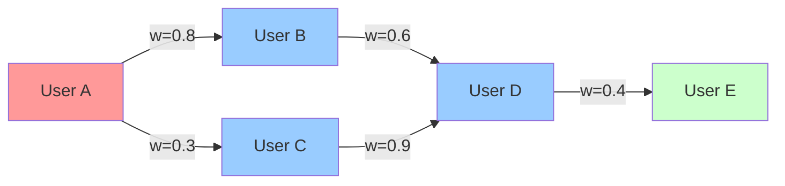

# Prerequisite Concepts and Mathematical Foundations

## Table of Contents
1. [Graph Theory Fundamentals](#1-graph-theory-fundamentals)
2. [Social Network Analysis](#2-social-network-analysis)
3. [Influence Maximization Theory](#3-influence-maximization-theory)
4. [Information Diffusion Models](#4-information-diffusion-models)
5. [Graph Embedding Techniques](#5-graph-embedding-techniques)
6. [Reinforcement Learning Foundations](#6-reinforcement-learning-foundations)
7. [Deep Learning for Combinatorial Optimization](#7-deep-learning-for-combinatorial-optimization)
8. [Topic Modeling and User Profiling](#8-topic-modeling-and-user-profiling)

---

## 1. Graph Theory Fundamentals

### 1.1 Basic Definitions

A **social network** is modeled as a directed graph $G = (V, E)$ where:
- $V$: Set of vertices (users/nodes), $|V| = n$
- $E$: Set of edges (relationships), $|E| = m$
- Edge $(u,v) \in E$ represents a directed relationship from user $u$ to user $v$

### 1.2 Graph Properties

#### Degree Centrality
For a node $v$:
- **In-degree**: $d_{in}(v) = |\{u : (u,v) \in E\}|$
- **Out-degree**: $d_{out}(v) = |\{u : (v,u) \in E\}|$

#### Neighborhood Structure
- **In-neighbors**: $N_{in}(v) = \{u : (u,v) \in E\}$
- **Out-neighbors**: $N_{out}(v) = \{u : (v,u) \in E\}$
- **k-hop neighborhood**: All nodes reachable within $k$ steps

### 1.3 Weighted Graphs

Each edge $(u,v)$ has an associated weight $w_{u,v} \in (0,1]$ representing:
- Connection strength
- Communication frequency  
- Trust level
- Influence probability



---

## 2. Social Network Analysis

### 2.1 Network Topology Models

#### Barabási-Albert (BA) Model
Used for generating scale-free networks with preferential attachment:
- Start with $m_0$ nodes
- Add nodes one by one
- Each new node connects to $m$ existing nodes
- Connection probability proportional to existing degree

**Algorithm**:
```
1. Initialize graph with m₀ nodes
2. For each new node v:
   - For i = 1 to m:
     - Select target u with probability P(u) = degree(u) / Σ degrees
     - Add edge (v,u)
```

#### Small-World Networks
Characterized by:
- High clustering coefficient
- Short average path length
- "Six degrees of separation" phenomenon

### 2.2 User Behavior Modeling

#### User Profiles
Each user $v$ has a profile vector $P_v = [p_1, p_2, ..., p_T]$ where:
- $p_i \in [0,1]$: Interest level in topic $i$
- $\sum_{i=1}^T p_i = 1$ (normalized)

#### User Similarity
**Cosine Similarity**:
$$\text{sim}(u,v) = \frac{P_u \cdot P_v}{||P_u|| \cdot ||P_v||} = \frac{\sum_{i=1}^T P_u[i] \cdot P_v[i]}{\sqrt{\sum_{i=1}^T P_u[i]^2} \cdot \sqrt{\sum_{i=1}^T P_v[i]^2}}$$

**Jaccard Similarity** (for binary preferences):
$$\text{sim}(u,v) = \frac{|S_u \cap S_v|}{|S_u \cup S_v|}$$

where $S_u$ is the set of topics user $u$ is interested in.

---

## 3. Influence Maximization Theory

### 3.1 Problem Formulation

**Definition**: Given a graph $G = (V,E)$, budget $k$, and diffusion model $M$, find a seed set $S \subseteq V$ with $|S| = k$ that maximizes the expected influence spread $\sigma_G(S)$.

**Objective Function**:
$$S^* = \arg\max_{S \subseteq V, |S|=k} \mathbb{E}[\sigma_G(S)]$$

where $\sigma_G(S)$ is the number of nodes activated by seed set $S$.

### 3.2 Computational Complexity

- **NP-Hard**: Proven by Kempe et al. [15]
- **Approximation**: Greedy algorithm achieves $(1-1/e-\epsilon)$ approximation
- **#P-Hard**: Computing exact influence spread

### 3.3 Submodularity

The influence function $\sigma_G(\cdot)$ is **submodular**:
$$\sigma_G(S \cup \{v\}) - \sigma_G(S) \geq \sigma_G(T \cup \{v\}) - \sigma_G(T)$$
for all $S \subseteq T \subseteq V$ and $v \notin T$.

This property enables the greedy approximation guarantee.

### 3.4 Greedy Algorithm

```
Input: Graph G, budget k, diffusion model M
Output: Seed set S

1. Initialize S = ∅
2. For i = 1 to k:
   3. Find v* = argmax_{v∈V\S} [σ(S ∪ {v}) - σ(S)]
   4. S = S ∪ {v*}
5. Return S
```

**Time Complexity**: $O(k \cdot n \cdot R \cdot m)$ where $R$ is the number of Monte Carlo simulations.

---

## 4. Information Diffusion Models

### 4.1 Independent Cascade (IC) Model

#### Model Description
- Each edge $(u,v)$ has activation probability $p_{u,v} \in [0,1]$
- Diffusion proceeds in discrete time steps
- Newly activated nodes get one chance to activate neighbors

#### Formal Algorithm
```
1. Initialize: Active₀ = S, Inactive₀ = V \ S
2. For t = 1, 2, ...:
   3. Active_t = Active_{t-1}
   4. For each u ∈ Active_{t-1} \ Active_{t-2}:
      5. For each v ∈ N_out(u) ∩ Inactive_{t-1}:
         6. Activate v with probability p_{u,v}
         7. If activated: Active_t = Active_t ∪ {v}
   8. If Active_t = Active_{t-1}: terminate
9. Return |Active_final|
```

#### Influence Computation
Expected influence spread:
$$\sigma_{IC}(S) = \mathbb{E}[\sum_{v \in V} P(\text{v is activated by S})]$$

### 4.2 Linear Threshold (LT) Model

#### Model Description
- Each edge $(u,v)$ has weight $b_{u,v} \geq 0$ with $\sum_{u \in N_{in}(v)} b_{u,v} \leq 1$
- Each node $v$ has threshold $\theta_v \sim \text{Uniform}[0,1]$
- Node activates when total weight from active neighbors exceeds threshold

#### Formal Algorithm
```
1. Sample θ_v ~ Uniform[0,1] for all v ∈ V
2. Initialize: Active₀ = S
3. For t = 1, 2, ...:
   4. For each v ∈ V \ Active_{t-1}:
      5. If Σ_{u ∈ N_in(v) ∩ Active_{t-1}} b_{u,v} ≥ θ_v:
         6. Active_t = Active_t ∪ {v}
   7. If no new activations: terminate
8. Return |Active_final|
```

#### Activation Probability
For node $v$ with in-neighbors $N_{in}(v)$:
$$P(\text{v activates}) = P\left(\sum_{u \in N_{in}(v)} b_{u,v} \cdot X_u \geq \theta_v\right)$$
where $X_u = 1$ if $u$ is active, 0 otherwise.

### 4.3 Topic-Aware Extensions

#### Topic-Aware IC Model
Activation probability depends on topics $\tau$:
$$p_{u,v}^{(\tau)} = \frac{\alpha_1 w_{u,v} + \alpha_2 \text{sim}(u,v) + \alpha_3 B_v^{(\tau)}}{3}$$

where:
- $w_{u,v}$: Base edge weight (contact frequency)
- $\text{sim}(u,v)$: User similarity
- $B_v^{(\tau)} = \sum_{t \in \tau} P_v[t]$: Benefit of user $v$ for topics $\tau$
- $\alpha_1, \alpha_2, \alpha_3 \in (0,1)$: Balance parameters

#### Topic-Aware LT Model
- Threshold: $\theta_v^{(\tau)} = 1 - \alpha_3 B_v^{(\tau)}$
- Edge weights: $b_{u,v}^{(\tau)} = \alpha_1 w_{u,v} + \alpha_2 \text{sim}(u,v)$

Lower threshold for users more interested in the topics.

---

## 5. Graph Embedding Techniques

### 5.1 Overview

Graph embedding maps nodes to low-dimensional vectors while preserving graph structure and properties.

**Goal**: Learn function $f: V \rightarrow \mathbb{R}^d$ where $d \ll |V|$

### 5.2 Classical Approaches

#### DeepWalk
Random walk + Skip-gram model:
1. Generate random walks starting from each node
2. Treat walks as sentences, nodes as words
3. Apply Word2Vec skip-gram to learn embeddings

#### Node2Vec
Biased random walks with parameters $p$ and $q$:
- Return parameter $p$: Controls likelihood of returning to previous node
- In-out parameter $q$: Controls exploration vs. exploitation

#### LINE (Large-scale Information Network Embedding)
Preserves both first-order and second-order proximity:
- **First-order**: Direct connections
- **Second-order**: Neighborhood similarity

### 5.3 Structure2Vec

Iterative embedding update framework:
$$u_v^{(t+1)} = F\left(x_v, \{u_u^{(t)}\}_{u \in N(v)}, \{w_{u,v}\}_{u \in N(v)}\right)$$

where:
- $u_v^{(t)}$: Embedding of node $v$ at iteration $t$
- $x_v$: Node features
- $F$: Nonlinear function (e.g., neural network)

### 5.4 Diffusion2Vec (Paper's Contribution)

Extension of Structure2Vec for influence maximization:

$$u_v^{(t+1)} = \text{relu}\left(\Theta_1 X_v + \Theta_2 \sum_{u \in N(v)} u_u^{(t)} + \Theta_3 \sum_{u \in N(v)} \text{relu}(\Theta_4 p_{u,v})\right)$$

**Key Features**:
- Incorporates selection status: $X_v[0] = 1$ if $v \in S$, else 0
- Includes user profile: $X_v[1:] = P_v$
- Uses topic-aware probabilities: $p_{u,v} = p_{u,v}^{(\tau)}$
- Aggregates T-hop neighborhood information

```mermaid
graph TB
    A[Node Features X_v] --> D[Neural Network F]
    B[Neighbor Embeddings] --> D
    C[Edge Weights p_u,v] --> D
    D --> E[Updated Embedding u_v^(t+1)]
    E --> F[Iterate T times]
    F --> G[Final Embedding u_v^(T)]
```

---

## 6. Reinforcement Learning Foundations

### 6.1 Markov Decision Process (MDP)

An MDP is defined by tuple $(S, A, P, R, \gamma)$:
- $S$: State space
- $A$: Action space  
- $P(s'|s,a)$: Transition probability
- $R(s,a,s')$: Reward function
- $\gamma \in [0,1]$: Discount factor

### 6.2 Q-Learning

**Objective**: Learn optimal action-value function $Q^*(s,a)$

**Bellman Equation**:
$$Q^*(s,a) = \mathbb{E}[R(s,a) + \gamma \max_{a'} Q^*(s',a') | s,a]$$

**Q-Learning Update**:
$$Q(s,a) \leftarrow Q(s,a) + \alpha[R + \gamma \max_{a'} Q(s',a') - Q(s,a)]$$

### 6.3 Deep Q-Networks (DQN)

Approximate Q-function with neural network $Q(s,a;\theta)$:

**Loss Function**:
$$L(\theta) = \mathbb{E}[(y_i - Q(s_i,a_i;\theta))^2]$$

where $y_i = R_i + \gamma \max_{a'} Q(s_{i+1},a';\theta^-)$

**Key Innovations**:
1. **Experience Replay**: Store transitions in buffer, sample mini-batches
2. **Target Network**: Separate network $\theta^-$ for stable targets

### 6.4 Double DQN (DDQN)

Addresses overestimation bias in standard DQN:

**Target**: 
$$y_i = R_i + \gamma Q(s_{i+1}, \arg\max_{a'} Q(s_{i+1},a';\theta);\theta^-)$$

Uses online network to select action, target network to evaluate.

### 6.5 Prioritized Experience Replay

Sample transitions based on temporal difference (TD) error:

**Priority**: $p_i = |\delta_i| + \epsilon$ where $\delta_i$ is TD-error

**Sampling Probability**: 
$$P(i) = \frac{p_i^{\alpha}}{\sum_k p_k^{\alpha}}$$

**Importance Sampling Weight**: 
$$w_i = \left(\frac{1}{N} \cdot \frac{1}{P(i)}\right)^{\beta}$$

---

## 7. Deep Learning for Combinatorial Optimization

### 7.1 Traditional vs. Learning Approaches

#### Traditional Methods
- Hand-crafted heuristics
- Problem-specific algorithms
- Require domain expertise
- Limited generalization

#### Learning-Based Methods
- Data-driven approach
- Automatic feature extraction
- End-to-end optimization
- Better generalization potential

### 7.2 Graph Neural Networks (GNNs)

General framework for learning on graphs:

**Message Passing**:
$$m_{u \rightarrow v}^{(t)} = \text{MSG}(h_u^{(t)}, h_v^{(t)}, e_{u,v})$$

**Aggregation**:
$$m_v^{(t+1)} = \text{AGG}(\{m_{u \rightarrow v}^{(t)} : u \in N(v)\})$$

**Update**:
$$h_v^{(t+1)} = \text{UPD}(h_v^{(t)}, m_v^{(t+1)})$$

### 7.3 Attention Mechanisms

**Self-Attention** for graphs:
$$\text{Attention}(Q,K,V) = \text{softmax}\left(\frac{QK^T}{\sqrt{d_k}}\right)V$$

**Graph Attention Networks (GAT)**:
$$\alpha_{ij} = \frac{\exp(\text{LeakyReLU}(\mathbf{a}^T[W\mathbf{h}_i || W\mathbf{h}_j]))}{\sum_{k \in N_i} \exp(\text{LeakyReLU}(\mathbf{a}^T[W\mathbf{h}_i || W\mathbf{h}_k]))}$$

---

## 8. Topic Modeling and User Profiling

### 8.1 Latent Dirichlet Allocation (LDA)

Probabilistic model for topic discovery:

**Generative Process**:
1. For each document $d$:
   - Draw topic distribution $\theta_d \sim \text{Dir}(\alpha)$
2. For each word $w_{d,n}$:
   - Draw topic $z_{d,n} \sim \text{Categorical}(\theta_d)$
   - Draw word $w_{d,n} \sim \text{Categorical}(\phi_{z_{d,n}})$

**Inference**: Use variational inference or Gibbs sampling to estimate:
- Document-topic distributions $\theta_d$
- Topic-word distributions $\phi_k$

### 8.2 User Profile Construction

From social media data (tweets, posts):

1. **Text Preprocessing**:
   - Tokenization, lowercasing
   - Stop word removal
   - Stemming/Lemmatization

2. **Topic Extraction**:
   - Apply LDA to user's corpus
   - Extract topic probabilities

3. **Profile Vector**:
   $$P_v = [\theta_{v,1}, \theta_{v,2}, ..., \theta_{v,T}]$$
   where $\theta_{v,t}$ is probability user $v$ is interested in topic $t$

### 8.3 Collaborative Filtering

**User-Based CF**:
$$\hat{r}_{u,i} = \bar{r}_u + \frac{\sum_{v \in N(u)} \text{sim}(u,v)(r_{v,i} - \bar{r}_v)}{\sum_{v \in N(u)} |\text{sim}(u,v)|}$$

**Item-Based CF**:
$$\hat{r}_{u,i} = \frac{\sum_{j \in R(u)} \text{sim}(i,j) \cdot r_{u,j}}{\sum_{j \in R(u)} |\text{sim}(i,j)|}$$

This provides the foundation for understanding the three metrics in the paper:
- User similarity
- User benefit  
- Contact frequency

---

## Further Reading and References

### Graph Theory and Networks
- Newman, M. "Networks: An Introduction" (2010)
- Easley, D. & Kleinberg, J. "Networks, Crowds, and Markets" (2010)
- Barabási, A.L. "Network Science" (2016)

### Influence Maximization
- Kempe, D., Kleinberg, J., Tardos, É. "Maximizing the spread of influence through a social network" (2003)
- Chen, W., Wang, Y., Yang, S. "Efficient influence maximization in social networks" (2009)
- Li, Y., et al. "Influence maximization on social graphs: A survey" (2018)

### Graph Embedding
- Hamilton, W.L. "Graph Representation Learning" (2020)
- Cui, P., et al. "A survey on network embedding" (2018)
- Cai, H., et al. "A comprehensive survey of graph embedding" (2018)

### Reinforcement Learning
- Sutton, R.S. & Barto, A.G. "Reinforcement Learning: An Introduction" (2018)
- Mnih, V., et al. "Human-level control through deep reinforcement learning" (2015)
- Van Hasselt, H., et al. "Deep reinforcement learning with double q-learning" (2016)

### Deep Learning for Graphs
- Kipf, T.N. & Welling, M. "Semi-supervised classification with graph convolutional networks" (2017)
- Veličković, P., et al. "Graph attention networks" (2018)
- Wu, Z., et al. "A comprehensive survey on graph neural networks" (2021)