# System Architecture and Algorithm Flow Diagrams

## Table of Contents
1. [Overall System Architecture](#1-overall-system-architecture)
2. [Topic-Aware Propagation Models](#2-topic-aware-propagation-models)
3. [Diffusion2Vec Architecture](#3-diffusion2vec-architecture)
4. [DIEM Network Structure](#4-diem-network-structure)
5. [Reinforcement Learning Workflow](#5-reinforcement-learning-workflow)
6. [Training Process Flow](#6-training-process-flow)
7. [Evaluation and Comparison Framework](#7-evaluation-and-comparison-framework)

---

## 1. Overall System Architecture

### High-Level System Overview

```mermaid
graph TB
    subgraph "Input Layer"
        A[Social Network G(V,E)]
        B[User Profiles {P_v}]
        C[Query Topics τ]
        D[Budget k]
    end
    
    subgraph "Topic-Aware Models"
        E[Contact Frequency w_uv]
        F[User Similarity sim(u,v)]
        G[User Benefits B_v^τ]
        H[Topic-Aware IC Model]
        I[Topic-Aware LT Model]
    end
    
    subgraph "Deep Learning Framework"
        J[Diffusion2Vec Embedding]
        K[Node Embeddings u_v^T]
        L[DIEM Evaluation Q̂]
    end
    
    subgraph "RL Training"
        M[Experience Buffer D]
        N[Double DQN]
        O[Prioritized Replay]
        P[Parameter Updates]
    end
    
    subgraph "Output Layer"
        Q[Greedy Selection]
        R[Seed Set S*]
        S[Influence Spread σ_G(S*|τ)]
    end
    
    A --> E
    B --> F
    B --> G
    C --> G
    
    E --> H
    F --> H
    G --> H
    
    E --> I
    F --> I
    G --> I
    
    A --> J
    B --> J
    H --> J
    I --> J
    
    J --> K
    K --> L
    
    L --> M
    M --> N
    N --> O
    O --> P
    P --> L
    
    L --> Q
    Q --> R
    R --> S
    
    style A fill:#ffcccc
    style B fill:#ffcccc
    style C fill:#ffcccc
    style J fill:#ccffcc
    style L fill:#ccffcc
    style N fill:#ccccff
    style R fill:#ffffcc
```

### Component Interaction Flow

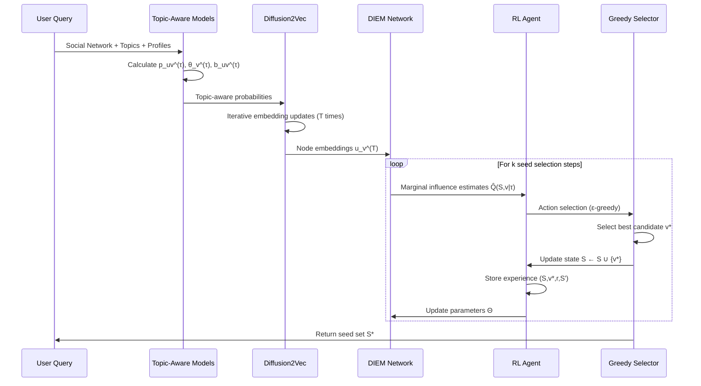

---

## 2. Topic-Aware Propagation Models

### Independent Cascade (IC) Model Extension

```mermaid
graph TB
    subgraph "Classical IC Model"
        A1[Edge Probabilities p_uv]
        B1[Random Activation]
        C1[Cascading Spread]
    end
    
    subgraph "Topic-Aware Extension"
        A2[Contact Frequency α₁w_uv]
        B2[User Similarity α₂sim(u,v)]
        C2[Target Benefits α₃B_v^τ]
        D2[Combined Probability]
    end
    
    subgraph "Enhanced IC Process"
        E2[Topic-Specific Activation]
        F2[Benefit-Weighted Influence]
        G2[Targeted Spread σ_G(S|τ)]
    end
    
    A2 --> D2
    B2 --> D2
    C2 --> D2
    
    D2 --> E2
    E2 --> F2
    F2 --> G2
    
    A1 -.-> A2
    B1 -.-> E2
    C1 -.-> F2
    
    style D2 fill:#ffcccc
    style F2 fill:#ccffcc
```

### Linear Threshold (LT) Model Extension

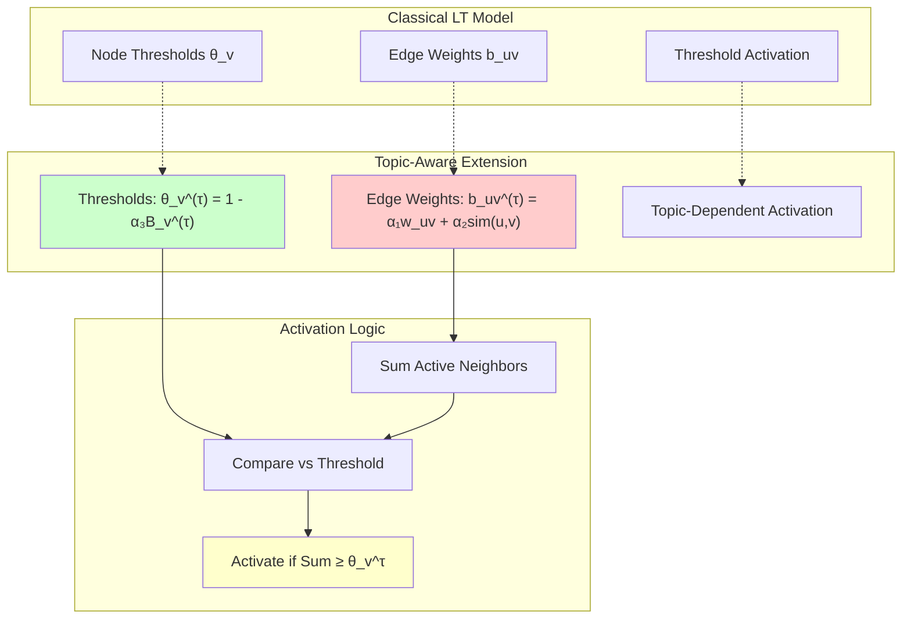

### Three-Metric Integration

```mermaid
graph LR
    subgraph "User Profiles"
        A[User u: P_u = [p₁, p₂, ..., pₜ]]
        B[User v: P_v = [p₁, p₂, ..., pₜ]]
    end
    
    subgraph "Metric Calculations"
        C["Contact Frequency: w_uv ∈ (0,1]"]
        D["Similarity: sim(u,v) = (P_u·P_v)/(||P_u||||P_v||)"]
        E["Benefit: B_v^τ = Σ_{t∈τ} P_v[t]"]
    end
    
    subgraph "Model Integration"
        F["IC: p_uv^τ = (α₁w_uv + α₂sim(u,v) + α₃B_v^τ)/3"]
        G["LT: b_uv^τ = α₁w_uv + α₂sim(u,v)"]
        H["LT: θ_v^τ = 1 - α₃B_v^τ"]
    end
    
    A --> D
    B --> D
    A --> E
    B --> E
    
    C --> F
    D --> F
    E --> F
    
    C --> G
    D --> G
    
    E --> H
    
    style D fill:#ffcccc
    style E fill:#ccffcc
    style F fill:#ffffcc
```

---

## 3. Diffusion2Vec Architecture

### Iterative Embedding Process

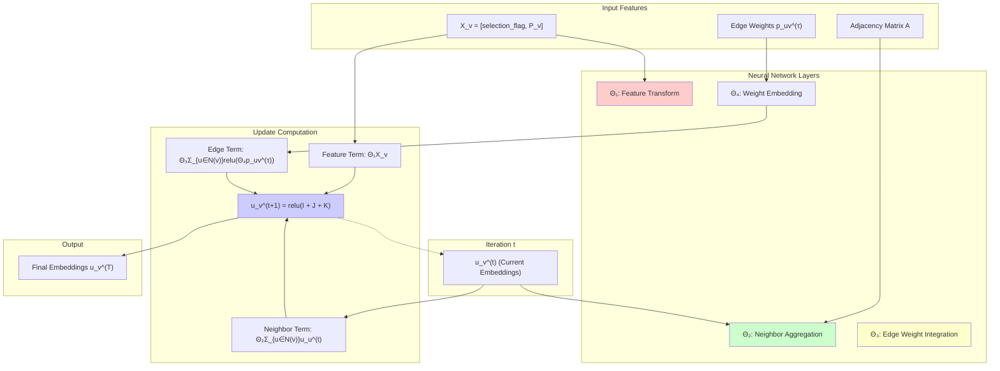

### Multi-Hop Information Propagation

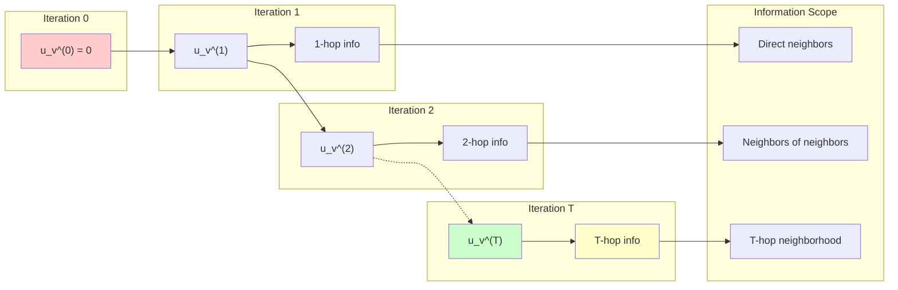

### Feature Aggregation Mechanism

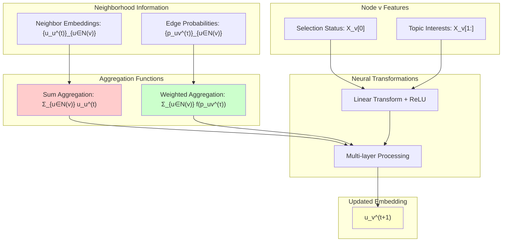

---

## 4. DIEM Network Structure

### Deep Influence Evaluation Architecture

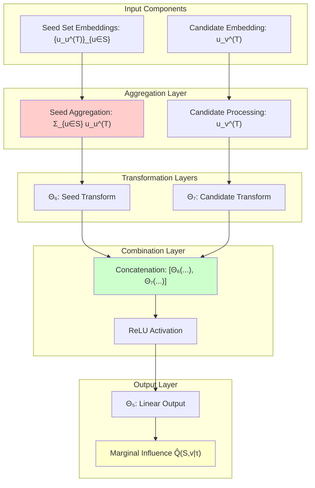

### DIEM Forward Pass Flow

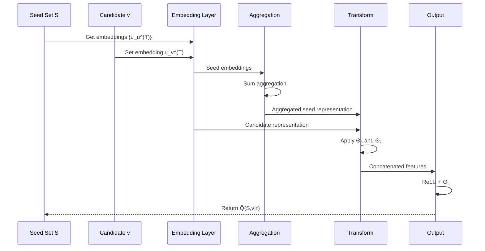

### Influence Estimation Concept

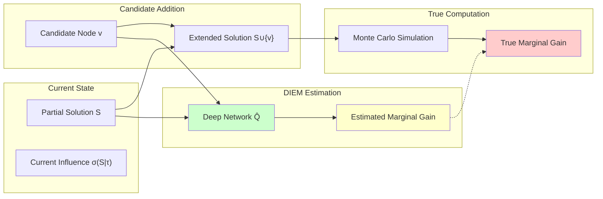

---

## 5. Reinforcement Learning Workflow

### MDP Formulation for TIM

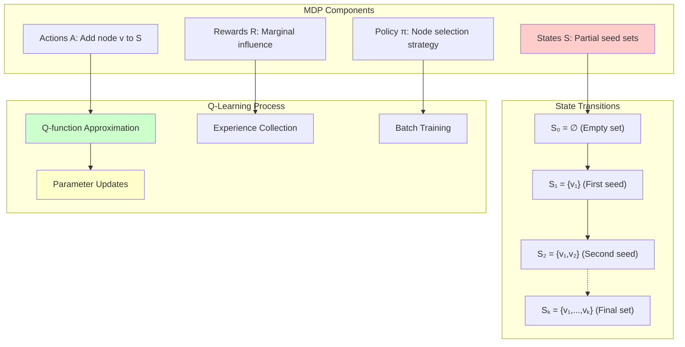

### Double DQN Architecture

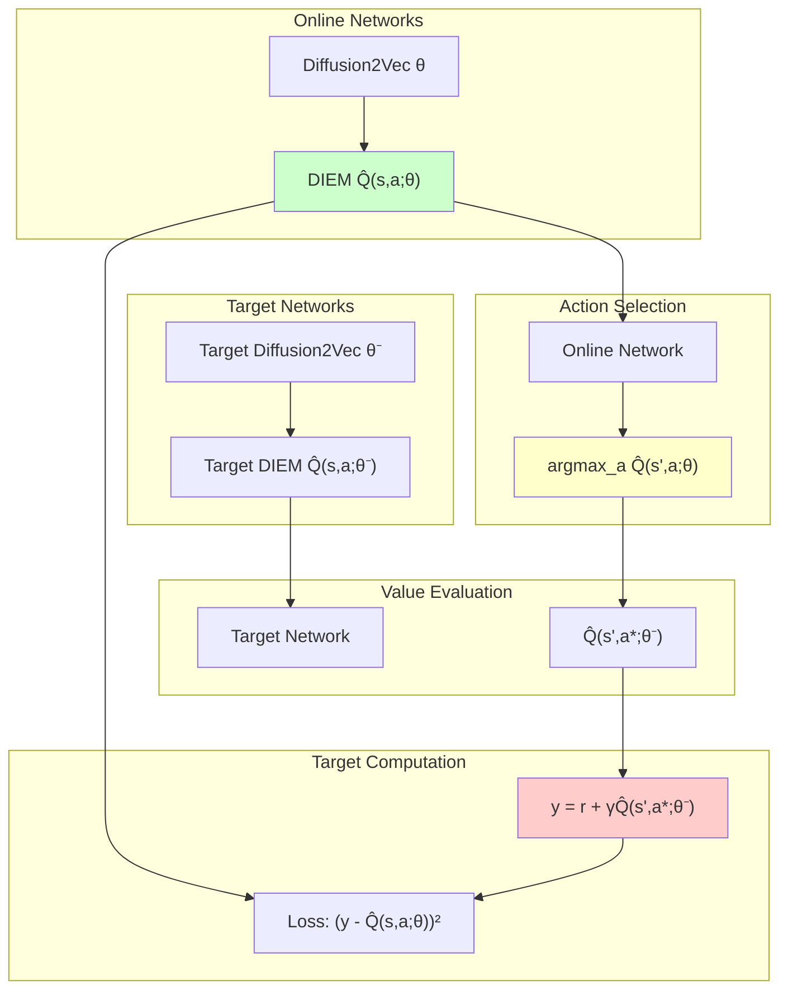

### Prioritized Experience Replay

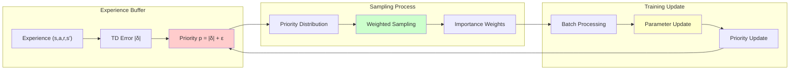

---

## 6. Training Process Flow

### End-to-End Training Pipeline

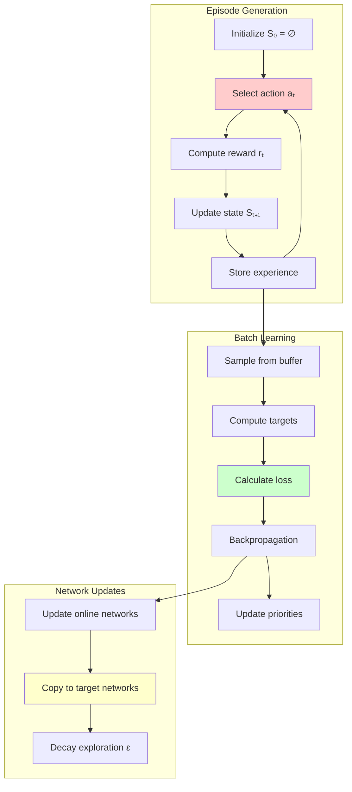

### Training Loop Dynamics

```mermaid
sequenceDiagram
    participant Env as Environment
    participant Agent as RL Agent
    participant Net as Neural Networks
    participant Buf as Replay Buffer
    participant Opt as Optimizer
    
    loop Episode
        Env->>Agent: Current state S
        Agent->>Net: Get Q-values
        Net-->>Agent: Q̂(S,v|τ) for all v
        Agent->>Agent: ε-greedy selection
        Agent->>Env: Action (selected node)
        Env->>Env: Compute true reward
        Env-->>Agent: Reward + new state
        Agent->>Buf: Store experience
    end
    
    loop Batch Training
        Buf->>Opt: Sample prioritized batch
        Opt->>Net: Compute targets (Double DQN)
        Net-->>Opt: Current Q-values
        Opt->>Opt: Compute loss + gradients
        Opt->>Net: Update parameters
        Opt->>Buf: Update priorities
    end
    
    Note over Net: Periodic target network update
```

### Learning Curve Analysis

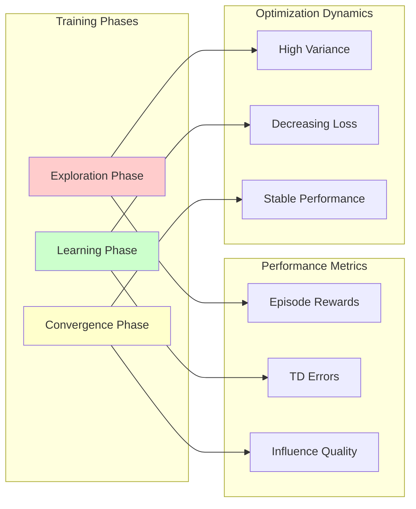

---

## 7. Evaluation and Comparison Framework

### Benchmark Architecture

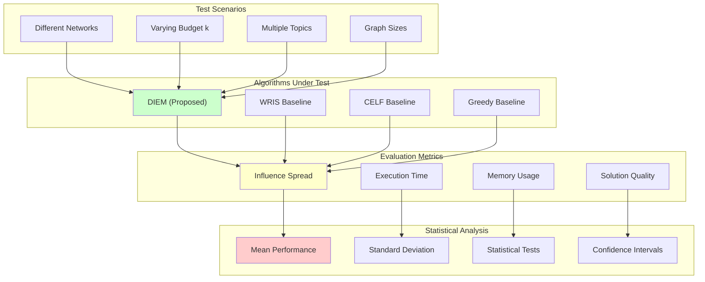

### Performance Comparison Visualization

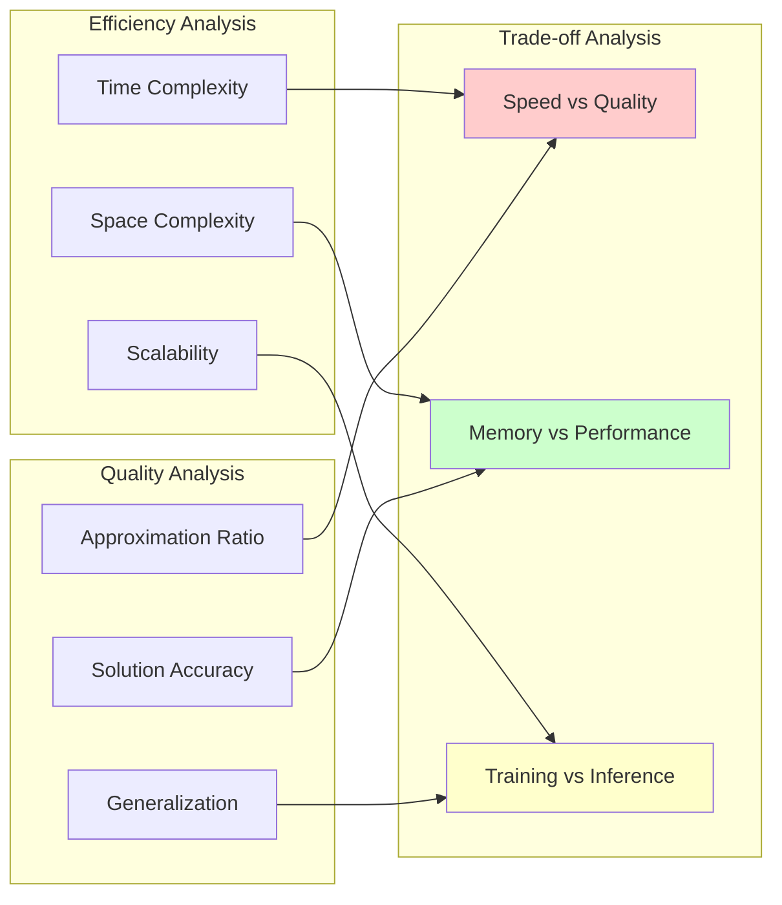

This comprehensive diagram collection provides visual representations of all major components and processes in the DIEM framework, making it easier to understand the complex interactions between different parts of the system.